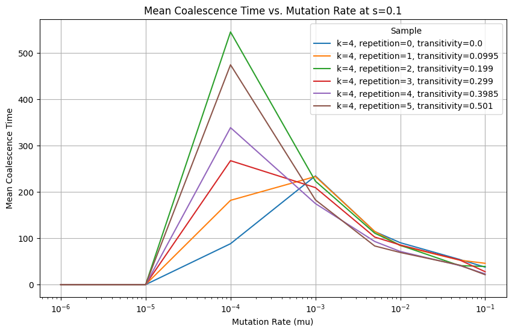
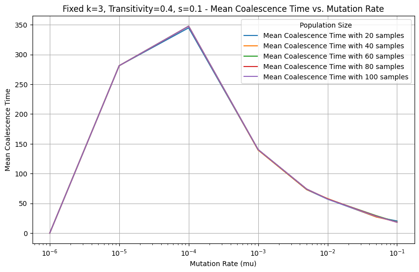
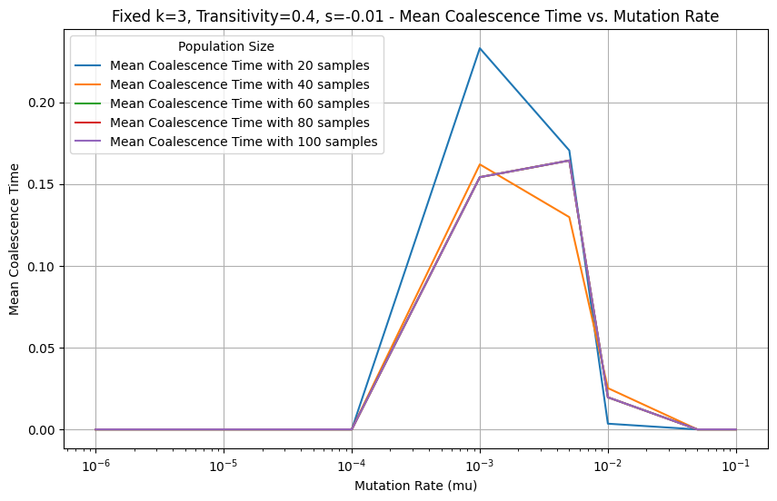

# Clonal-Tree
The mean Coalescence Time against Transitivity trend is quite clear for high mutation rate and strong s:

Mean Coalescence Time against mutation rate:

The experiment runs 100 simulations for each graph, and randomly picks 10 nodes to calculate coalescence time for i = 20, 40, 60, 80, 100 times:
The mean value is quite consistent for positive s value:

For negative s value:

